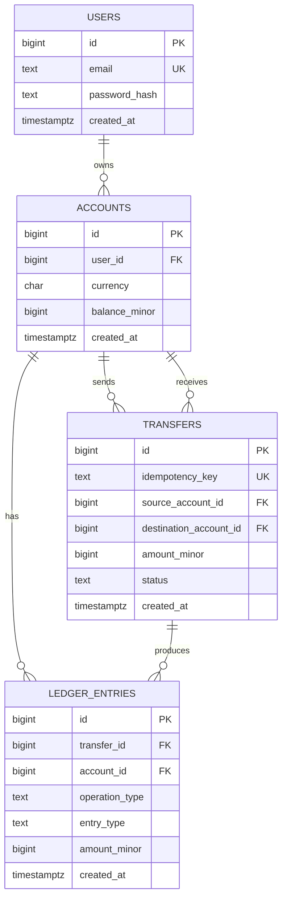

# PayFlow Database ERD

## 1. Purpose

This document describes the initial database model for PayFlow, a transactional wallet and payments system.

The model is intentionally designed for the MVP. It focuses on:

- monetary correctness,
- atomic balance updates,
- transaction history,
- idempotent transfers,
- explicit foreign-key relationships,
- PostgreSQL constraints as a second line of defence for business rules.

The application uses PostgreSQL, `BIGINT` amounts expressed in minor currency units, and manual SQL through `pgx`.

## 2. Entity relationship diagram



The diagram shows the possible foreign-key relationships. The business rule requires exactly two ledger entries for every completed transfer. This rule is enforced by the service layer and integration tests in the MVP.

## 3. Tables

### 3.1 `users`

Stores users who can access the PayFlow API.

| Column | PostgreSQL type | Constraints | Description |
|---|---|---|---|
| `id` | `BIGINT` | `PRIMARY KEY`, identity | Unique user identifier |
| `email` | `TEXT` | `NOT NULL`, `UNIQUE` | Normalized user email address |
| `password_hash` | `TEXT` | `NOT NULL` | Bcrypt password hash; plaintext passwords must never be stored |
| `created_at` | `TIMESTAMPTZ` | `NOT NULL`, default `now()` | Time when the user was created |

#### Rules

- Email is normalized to lowercase and trimmed by the application before inserting or searching.
- `email` must be unique.
- The database stores only the bcrypt hash, never the original password.
- User deletion is not part of the initial API scope.

Recommended definition:

```sql
CREATE TABLE users (
    id BIGINT GENERATED ALWAYS AS IDENTITY PRIMARY KEY,
    email TEXT NOT NULL UNIQUE,
    password_hash TEXT NOT NULL,
    created_at TIMESTAMPTZ NOT NULL DEFAULT now()
);
```

### 3.2 `accounts`

Represents a user's wallet in one currency.

For the MVP, registration creates one account in PLN for every user.

| Column | PostgreSQL type | Constraints | Description |
|---|---|---|---|
| `id` | `BIGINT` | `PRIMARY KEY`, identity | Unique account identifier |
| `user_id` | `BIGINT` | `NOT NULL`, foreign key | Owner of the account |
| `currency` | `CHAR(3)` | `NOT NULL`, allowed value `PLN` | ISO-like currency code; only PLN is supported in the MVP |
| `balance_minor` | `BIGINT` | `NOT NULL`, default `0`, `>= 0` | Current balance in minor currency units, for example grosze |
| `created_at` | `TIMESTAMPTZ` | `NOT NULL`, default `now()` | Time when the account was created |

#### Rules

- `balance_minor` is always stored as a whole number of minor units.
- `balance_minor` must never be negative.
- A user can have at most one account for a given currency.
- A new user receives one PLN account during registration.
- The account balance is updated inside the same database transaction as the related ledger entries.

Recommended definition:

```sql
CREATE TABLE accounts (
    id BIGINT GENERATED ALWAYS AS IDENTITY PRIMARY KEY,
    user_id BIGINT NOT NULL REFERENCES users(id),
    currency CHAR(3) NOT NULL DEFAULT 'PLN',
    balance_minor BIGINT NOT NULL DEFAULT 0,
    created_at TIMESTAMPTZ NOT NULL DEFAULT now(),

    CONSTRAINT accounts_currency_supported
        CHECK (currency IN ('PLN')),

    CONSTRAINT accounts_balance_non_negative
        CHECK (balance_minor >= 0),

    CONSTRAINT accounts_user_currency_unique
        UNIQUE (user_id, currency)
);
```

### 3.3 `transfers`

Stores successfully completed money transfers between two accounts.

For the initial synchronous MVP, a transfer is completed inside one database transaction.

| Column | PostgreSQL type | Constraints | Description |
|---|---|---|---|
| `id` | `BIGINT` | `PRIMARY KEY`, identity | Unique transfer identifier |
| `idempotency_key` | `TEXT` | `NOT NULL`, `UNIQUE` | Client-provided key preventing duplicate processing |
| `source_account_id` | `BIGINT` | `NOT NULL`, foreign key | Account from which money is debited |
| `destination_account_id` | `BIGINT` | `NOT NULL`, foreign key | Account to which money is credited |
| `amount_minor` | `BIGINT` | `NOT NULL`, `> 0` | Transfer amount in minor currency units |
| `status` | `TEXT` | `NOT NULL`, allowed value `completed` | Current transfer status |
| `created_at` | `TIMESTAMPTZ` | `NOT NULL`, default `now()` | Time when the transfer was created |

#### Allowed status values

```text
completed
```

The MVP executes transfers synchronously. A transfer row is created only as part of the successful atomic operation, so `completed` is the only required status initially.

Future statuses such as `pending` or `failed` should be introduced only if the processing model becomes asynchronous or externally integrated.

#### Rules

- The amount must be greater than zero.
- Source and destination accounts must be different.
- Both accounts must use the same currency in the MVP.
- A transfer debits the source account and credits the destination account.
- The transfer row and both ledger entries must be created in the same database transaction.
- The same `idempotency_key` must not create a second transfer.
- Reusing an existing idempotency key with different request data must result in a conflict, not a second operation.
- Account locks must be acquired in ascending account ID order to reduce deadlock risk.
- Transfers should not be deleted because they are part of the financial history.

Recommended definition:

```sql
CREATE TABLE transfers (
    id BIGINT GENERATED ALWAYS AS IDENTITY PRIMARY KEY,
    idempotency_key TEXT NOT NULL UNIQUE,
    source_account_id BIGINT NOT NULL REFERENCES accounts(id),
    destination_account_id BIGINT NOT NULL REFERENCES accounts(id),
    amount_minor BIGINT NOT NULL,
    status TEXT NOT NULL DEFAULT 'completed',
    created_at TIMESTAMPTZ NOT NULL DEFAULT now(),

    CONSTRAINT transfers_amount_positive
        CHECK (amount_minor > 0),

    CONSTRAINT transfers_different_accounts
        CHECK (source_account_id <> destination_account_id),

    CONSTRAINT transfers_status_valid
        CHECK (status IN ('completed'))
);
```

### 3.4 `ledger_entries`

Stores an immutable audit trail of account balance movements.

Each transfer creates two entries:

- one `debit` entry for the source account,
- one `credit` entry for the destination account.

Deposits and withdrawals also create entries in this table.

| Column | PostgreSQL type | Constraints | Description |
|---|---|---|---|
| `id` | `BIGINT` | `PRIMARY KEY`, identity | Unique ledger entry identifier |
| `transfer_id` | `BIGINT` | nullable, foreign key | Related transfer; `NULL` for deposits and withdrawals |
| `account_id` | `BIGINT` | `NOT NULL`, foreign key | Account affected by the operation |
| `operation_type` | `TEXT` | `NOT NULL`, allowed values | Business operation that produced the entry |
| `entry_type` | `TEXT` | `NOT NULL`, allowed values | Whether the entry increases or decreases the account balance |
| `amount_minor` | `BIGINT` | `NOT NULL`, `> 0` | Entry amount in minor currency units; always positive |
| `created_at` | `TIMESTAMPTZ` | `NOT NULL`, default `now()` | Time when the entry was created |

#### Allowed `operation_type` values

```text
deposit
withdrawal
transfer
```

#### Allowed `entry_type` values

```text
credit
debit
```

`amount_minor` is always positive. The direction is represented by `entry_type`, not by a negative number.

Examples:

| Operation | `operation_type` | `entry_type` | `amount_minor` |
|---|---|---|---:|
| Deposit of PLN 50.00 | `deposit` | `credit` | `5000` |
| Withdrawal of PLN 20.00 | `withdrawal` | `debit` | `2000` |
| Transfer from account A | `transfer` | `debit` | `1000` |
| Transfer to account B | `transfer` | `credit` | `1000` |

Recommended definition:

```sql
CREATE TABLE ledger_entries (
    id BIGINT GENERATED ALWAYS AS IDENTITY PRIMARY KEY,
    transfer_id BIGINT REFERENCES transfers(id),
    account_id BIGINT NOT NULL REFERENCES accounts(id),
    operation_type TEXT NOT NULL,
    entry_type TEXT NOT NULL,
    amount_minor BIGINT NOT NULL,
    created_at TIMESTAMPTZ NOT NULL DEFAULT now(),

    CONSTRAINT ledger_amount_positive
        CHECK (amount_minor > 0),

    CONSTRAINT ledger_operation_type_valid
        CHECK (operation_type IN ('deposit', 'withdrawal', 'transfer')),

    CONSTRAINT ledger_entry_type_valid
        CHECK (entry_type IN ('credit', 'debit'))
);
```

#### Application-level consistency rules

The following rules are initially enforced in the service layer and integration tests:

- `operation_type = 'transfer'` should have a non-null `transfer_id`.
- `operation_type IN ('deposit', 'withdrawal')` should have a null `transfer_id`.
- One transfer should produce exactly two ledger entries.
- The two entries for one transfer should have the same positive amount.
- One transfer should produce exactly one `debit` and one `credit` entry.
- The debit entry belongs to `source_account_id`.
- The credit entry belongs to `destination_account_id`.

These rules can later be strengthened with a database trigger if the project needs it. A trigger is intentionally not required for the initial MVP.

## 4. Foreign-key relationships

| Relationship | Cardinality | Meaning |
|---|---|---|
| `users` → `accounts` | one-to-many | One user can own accounts in multiple currencies in the future |
| `accounts` → `transfers.source_account_id` | one-to-many | One account can send many transfers |
| `accounts` → `transfers.destination_account_id` | one-to-many | One account can receive many transfers |
| `accounts` → `ledger_entries` | one-to-many | One account has many balance movement records |
| `transfers` → `ledger_entries` | one-to-many | One transfer produces exactly two ledger entries as a business rule |

## 5. Monetary and consistency rules

1. All monetary values are stored as `BIGINT` minor units.
2. Floating-point types must not be used for money.
3. `amount_minor` must always be greater than zero.
4. `accounts.balance_minor` must never be negative.
5. Deposit balance update and deposit ledger insert are one atomic transaction.
6. Withdrawal balance update and withdrawal ledger insert are one atomic transaction.
7. Transfer debit, transfer credit, transfer insert, and both ledger inserts are one atomic transaction.
8. Transfer account locks are acquired in ascending account ID order.
9. Repeated requests with the same idempotency key must not duplicate a monetary operation.
10. Transfers and ledger entries are historical records and should not be physically deleted.

## 6. Indexes

Primary keys and unique constraints automatically create indexes. The following additional indexes are recommended for common queries:

```sql
CREATE INDEX idx_accounts_user_id
    ON accounts (user_id);

CREATE INDEX idx_transfers_source_account_id_created_at
    ON transfers (source_account_id, created_at DESC);

CREATE INDEX idx_transfers_destination_account_id_created_at
    ON transfers (destination_account_id, created_at DESC);

CREATE INDEX idx_ledger_entries_account_id_created_at
    ON ledger_entries (account_id, created_at DESC);

CREATE INDEX idx_ledger_entries_transfer_id
    ON ledger_entries (transfer_id);
```

The `ledger_entries` account index supports paginated account history queries.

## 7. Deliberate MVP limitations

- The database model is multi-currency-ready, but the MVP supports only PLN. The currency constraint can be extended when additional currencies and currency-specific business rules are implemented.
- One user can have only one account per currency.
- Transfers are synchronous.
- There is no external payment provider.
- There are no refunds, chargebacks, scheduled transfers, fees, or exchange rates.
- There is no soft-delete or account-closing workflow.
- Transfer status is limited to `completed`.
- The database does not yet use custom PostgreSQL enum types; allowed values are represented with `TEXT` plus `CHECK` constraints to keep migrations simple and easy to evolve.